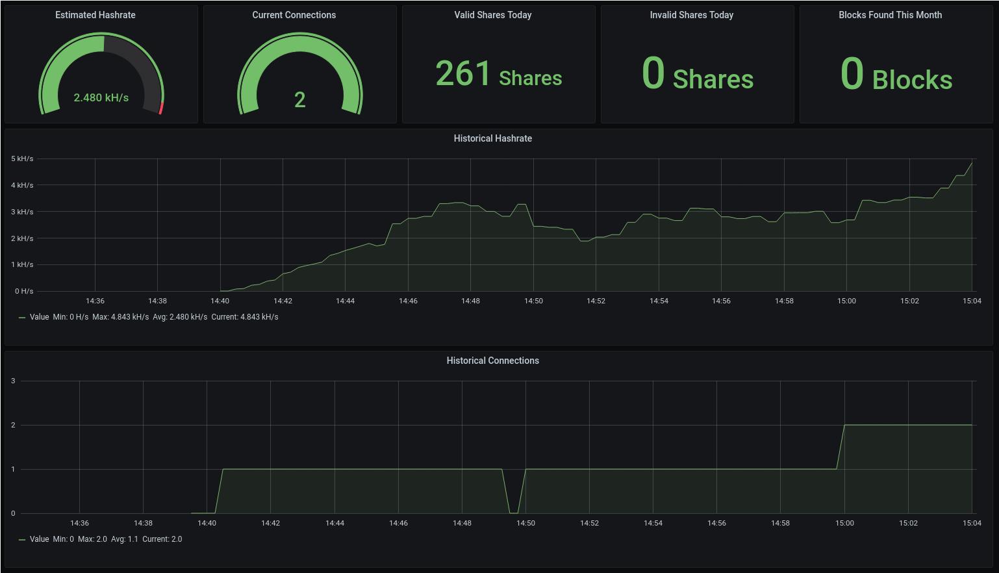

# solo-pool-deployment

Example deployment of
[solo-pool](https://github.com/moneromint/solo-pool).

## Services

* Grafana
* Prometheus
* solo-pool
* node-exporter

## Ports

* 3333: Stratum, no TLS. Connect your miner here.
* 8000: Pool HTTP. For metrics scraping and block notifications.
* 8080: Grafana. Default credentials are admin:admin.

## Configuration

Edit `docker-compose.yaml` and paste in your daemon's address and your
wallet address.

## Deployment

Run `docker-compose up`. When running in Swarm mode, add as many
solo-pool replicas as you want.

It is recommended to copy `block-notify.sh` somewhere and to launch
monerod with `--block-notify /path/to/block-notify.sh` so that the
pool is notified of new blocks faster.

## Screenshot

## License

Contents of this repository are public domain.
